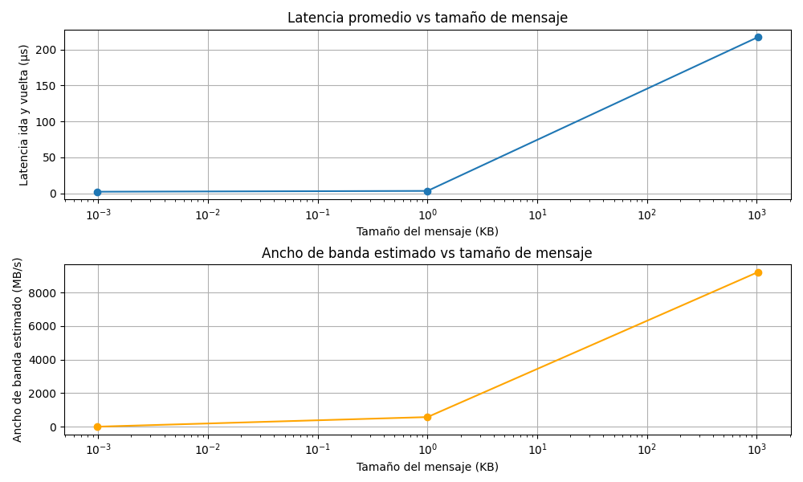

# Tarea 3 -  Medición de latencia y comunicación colectiva

## Descripción

Se implementan dos programas en Python usando mpi4py:

- **Parte A:** Cálculo de mínimo, máximo y promedio global de un arreglo usando MPI_Bcast, MPI_Scatter, MPI_Reduce y MPI_Gather.
- **Parte B:** Medición de latencia punto a punto entre dos procesos usando MPI_Send y MPI_Recv.
- **Parte Opcional:** Medición de latencia punto a punto entre dos procesos usando MPI_Send y MPI_Recv usando distintos tamaños de mensajes.

---

## Requisitos previos

- Python 3
- Virtual Environment (opcional)
- Instalar mpi4py

---

## Archivos

- `ParteA.py`: operaciones colectivas
- `ParteB.py`: medición de latencia
- `ParteOpcionak.py`: medición de latencia con diferentes tamaños

---

## Instrucciones para ejecutar

### Parte A - Operaciones colectivas

Ejecutar con N procesos (N debe ser divisible entre el número de procesos):

(Desde la terminal en el directorio con el archivo)  
  
  mpirun -np N ./mpi_env/bin/python ParteA.py T
 
  N: Numero de procesos
  
  T: Cantidad de números que se quieren procesar.

### Parte B - Medición de latencias

Ejecutar con 2 procesos:

(Desde la terminal en el directorio con el archivo)  
 
  mpirun -np 2 python Parte_B.py

### Parte Opcional - Medición de latencias con diferentes tamaños  

Ejecutar con 2 procesos (el programa correra por los distintos tamaños del mensaje):

(Desde la terminal en el directorio con el archivo)
 
  mpirun -np 2 python Parte_Opcional.py

Se crearan archivos para visualizar latencia y bandwidth. 

## Resultados y Análisis

### Parte A - Operaciones colectivas

Proceso 0: se generó un arreglo con 1000000 números aleatorios.  
Proceso 1: recibió 250000 números.  
Proceso 1: min = 0.00, max = 100.00, promedio = 49.93  
Proceso 2: recibió 250000 números.  
Proceso 2: min = 0.00, max = 100.00, promedio = 50.02  
Proceso 0: recibió 250000 números.  
Proceso 3: recibió 250000 números.  
Proceso 3: min = 0.00, max = 100.00, promedio = 50.10  
Proceso 0: min = 0.00, max = 100.00, promedio = 49.97  

=== Resultados globales ===  
Min global: 0.00  
Max global: 100.00  
Promedio global: 50.01  

A partir de estos resultados, se puede ver una distribución equitativa de los numeros totales. Fueron 4 procesos para 1 millón de números, lo cual significa 250k números para cada proceso. En caso de que el los números no se pudieran dividir en 4, el programa no permitiría proceder. Según iban terminando la tarea de distribuir números y encontrar el minimo, máximo y promedio, los resultados se iban imprimiendo. Se destaca que conforme se repartían, inmediatamente terminaban de hacer la tarea. Por ejemplo, el proceso 2 aun no había recibido sus números y el proceso 1 ya había sacado sus métricas. 

Es importante notar que el rango de los números es de 0-100, y dado de que cada proceso recibió 250k números, es casi imposible que 0 y 100 no salieran de mínimo y máximo. Con menos muchos números aleatorios y un rango más amplio (ej: 0-10000), quizá cada proceso muestre un mínimo y máximo diferente. En este caso, todos los procesos definitivamente recibieron el número 0 y el número 100 probablemente varias veces. Además dado que el rango es tan pequeño, era de esperar que el promedio sería cerca a 50. Sería muy díficil que con un arreglo de números aleatorios, salgan muchos números sobre o debajo de 50 como para jalar el promedio lejos del 50. Esto se ve en los resultados globales y también en cada proceso, indicando que la repartición de los números sí fue equitativa. 

### Parte B - Medición de latencias

Mensaje de 1 byte transmitido 10000 veces.  
Latencia promedio por mensaje (ida y vuelta): 1.43 microsegundos  
Latencia estimada unidireccional: 0.72 microsegundos  

En este caso, se transmitió un mensaje de 1 byte 10k veces utilizando las operaciones de MPI. El resultado fue una latencia promedio de 1.43 microsegundos por mensaje (ida y vuelta) y una latencia unidireccional de aproximadamente 0.72 microsegundos. Estas métricas son veloces y muestran estabilidad en transmisión. En términos de computación paralela y distribuida, las operaciones Punto a Punto (Send y Recv) ayudaron a medir el tiempo que tardan las transmiciones con gran precisión, lo cual es muy útil a gran escala. Las operaciones que se usaron en este caso son diferentes a las colectivas ya que muestran más especificidad y control sobre la comunicación entre procesos. Depende del caso que tipo de operaciones usar. 

### Parte Opcional - Medición de latencias con diferentes tamaños

μs: microsegundos

Tamaño mensaje: 1 bytes  
Latencia promedio ida y vuelta: 1.77 μs  
Latencia estimada unidireccional: 0.89 μs  
Ancho de banda estimado: 1.08 MB/s  

Tamaño mensaje: 1024 bytes  
Latencia promedio ida y vuelta: 2.40 μs  
Latencia estimada unidireccional: 1.20 μs  
Ancho de banda estimado: 813.02 MB/s  

Tamaño mensaje: 1048576 bytes  
Latencia promedio ida y vuelta: 134.89 μs  
Latencia estimada unidireccional: 67.45 μs  
Ancho de banda estimado: 14826.61 MB/s  

Por último, este análisis muestra cómo se comportan las operaciones punto a punto al aumentar el tamaño de los mensajes. Los resultados indican que la relación entre el ancho de banda y la latencia depende del tamaño del mensaje: en mensajes pequeños, la latencia es más alta y limita la comunicación, mientras que en mensajes grandes, el ancho de banda es el factor principal que afecta el rendimiento, mostrando que MPI maneja bien ambas situaciones según el tipo de transferencia.

  
